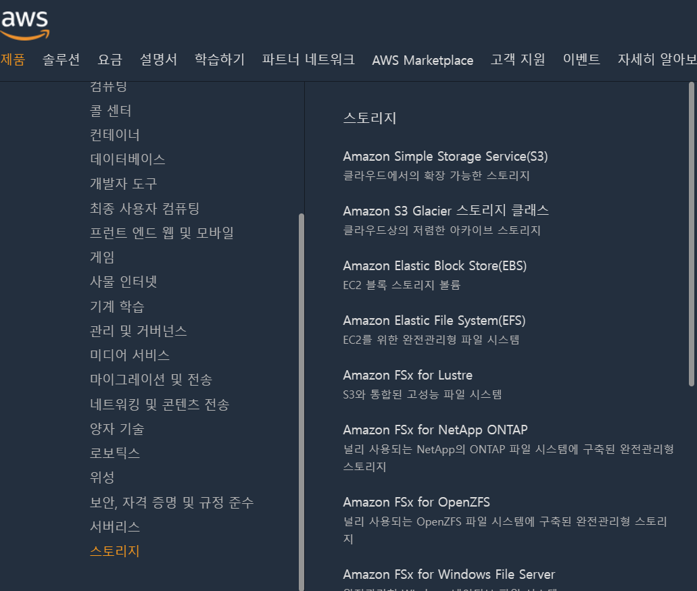

# 필요한 서비스 찾기

- 스토리지

- DBMS 운영 

- 인공지능

  ...

# 리전 개념

> 여러 개의 데이터 센터를 클러스터링하는 물리적위치(서울 리전, 홍콩 리전 등)

- 전세계 주요국가에 위치

- 1개 AWS 리전 = 2개 이상의 가용영역으로 구성
  
  - ❔가용영역 
  
    ❕하나 이상의 개별데이터 센터
  
  - 가용영역끼리는 물리적으로 떨어져있고, 고속 네트워크로 연결됨
  
  - 고가용성 설계 = 다중 AZ(Multi-AZ), 2개 이상의 가용영역에 시스템 배치
  
  - 엣지 로케이션
    - 엣지 로케이션에 콘텐츠(데이터)를 캐싱하여 사용자에게 더 짧은 지연 시간으로 콘텐츠 전송
  
- 대부분의 AWS서비스는 리전을 선택하여 시작
  - 리전을 선택하지 않는 글로벌 서비스도 있음
    - IAM 서비스 - 계정운영 서비스, 리전 단위로 관리하지 않아도 됨
  
- 재해복구(DR) 설계 - 2개 이상의 리전에 시스템을 배치

# 콘솔

# EC2

# Cloud

# IAM

# S3

# 웹 호스팅

# Lambda

# Amplify Framework

# MySQL 설치

