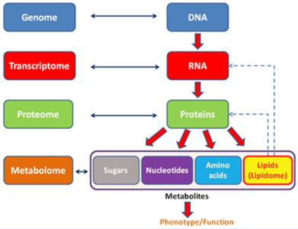

# Basic Concept for Bioinformatics and Biomedical Machine Learning

### 1. Introduction to Biomedical Machine learning

> Biomedical 분야에서는 특정 domain 전문가를 대신하거나, 실험으로 얻어진 값을 찾고, 사람이 찾기 어려운 pattern을 찾아낸다.
>
> ∴ 데이터 레이블링 비용이 비싼 경우가 많음

- Histology(조직학)
  - 병리 조직 이미지
  - data를 나누고 
  - data를 설명하는 함수를 만듦
  - 인간이 할 수 있는 3가지 대표 과제
    - Tumor detection(종양 발견)
    - Subtyping
    - Grading(중증도)
  - 수치를 통해 예측할 수있는 부분
    - Survival prediction
    - Mutation prediction => 유전체 분석 대신 병리 이미지로 알 수 있는 것
    - Response prediction => 3차 표적 항암제, 면역 항암제
    - [Universal approximation theorem](https://en.wikipedia.org/wiki/Universal_approximation_theorem)
  - Bio-Medical Machine Learning - Histology
    - Define task 
    - Obtain data
    - Form test set (if supervised)
    - Select model
    - Train
    - Tune
    - Test (if supervised)
  - Data modalities
    - Modality: 데이터의 형태나 차원이 완전히 다른 것에서 가져온 데이터
      - DNA sequences, Gene expressions, Proteins, Compounds, Diseases, Biomedical Networks, Spatial data, Image, Text, ...etc
    - Biomedical Task
      - Target discovery: novel disease targets을 찾는 것
      - Therapeutics discovery: 치료제를 large-scale screening 하는 것
      - Clinical study: 치료제의 안정성과 효능을 예측하는 것
      - Post-market study: post-market research 결과로부터 의미있는 정보를 추론하는 것
    - Machine learning/Deep learning 모델
      - Classical Machine learning, Multi-layer perceptron, Convolution neural network, Recurrent neural network, Transformer, Graph neural networks, Autoencoders, Generative models

### 2. Machine Learning workflow

- Data Curation
  - 데이터 수집, 정제에서 annotation과 분류, 학습용 데이터 생성 등 데이터 활용 가치를 높이기 위한 모든 활동
  - Data structure을 만들고, Digital Vector화 하는 것도 포함
  - Data를 Split하는 과정도 포함
  - Data Modality 종류에 따라 Data structure를 만들기도 하고, Vector화 하는 방식이 달라진다. 
  - 기존에 알려진 방법으로 Feature를 만들기도 하고, 간단한 Vector로 처리하여 모델에 Feature extraction을 맡기는 경우도 있다.
  - 모델링 경쟁을 해야하는 인공지능 연구와 달리 Biomedical machine learning 연구에서는 데이터부터 정리 안된 경우가 많아서 직접 처리해야하는 경우가 많다.(데이터가 모여있지 않아서 통합하는 과정도 많이 필요하고, 과연 Fair한가에 대한 의구심이 많이 듦)
  
- Data split

  > Task가 어렵고, 데이터가 적은 경우(특히, Biomedical 분야에서) split을 어떻게 하느냐에 따라 성능이 많이 변함 => 모델 신뢰도의 문제가 있음

  - Dataset
    - Training
      - Training
      - Validation
    - Testing
  - 데이터가 적을 때는 Training Dataset 안에서 Testset을 또 나누어, K-fold(or Cross Validation) 을 사용

- Therapeutics Data Commons

  - curation하지 않고, 바로 ML 모델에만 집중할 수 있게끔 해주는 API 제공 사이트

    - https://tdcommons.ai

  - Loading TDC benchmark class

    ```python
    from tdc.benchmark_group import admet_group
    group = admet_group(path='data/')
    benchmark = group.get('Caco2_Wang')
    ```

  - Get ML-ready train/val/test data

    ```python
    predictions = {}
    name = benchmark['name']
    train_val, test = benchmark['train_val'], benchmark['test']
    ```

  - Train your model

    ```python
    ## --- train your model --- ##
    ```

  - Return ready to submit metrics

    ```python
    predications[name] = y_pred
    group.evaluate(predictions)
    # {'caco2_wang': {'mae' : 0.234}}
    ```

- Build ML Models

  -  데이터 특성에 맞는 모델을 설계하고 구현하는 과정(Inductive bias)
  - 큰 형태의 대표적인 모델에서 크게 벗어나지 않음(딥러닝 기준)

  <details><summary>Inductive bias
  </details>

  각 data unit 사이의 relationship을 근거로 사람의 intuition으로 가설을 만들고, 그 가설에 맞는 의도를 담은 수학적인 모델을 설계하는 일

  </Details>

  - CNN, which has a strong inductive bias that the information is locally aggregated. 
  - RNN, which has a strong inductive bias that it is strongly correlated with the previous time. 
  - Self-Attention, which has a relatively weak inductive bias because it only correlates all features.
  - Machine Leaning model은 해당 Inductive bias 범주에서 많이 벗어나지 않음
  - 8가지의 모델만 알아도 대다수 Biomedical Task들을 해결할 수 있음
    - Calssic Machine learning
    - Deep Neural Network
    - Convolutional Neural Network
    - Recurrent Neural Network
    - Transformer
    - Graph Neural Network
    - Autoencoder
    - Generative Model

- Validation & Deployment

  > - 새로운 실험 데이터에도 해당 모델이 효과가 있는지 확인하는 과정이 필요
  > - Model의 Interpretability를 통하여 모델을 분석하는 과정이 필요
  > - 정답이 없는 실제 Data에 대해 추론하는 Process를 만들어야 함
  > - Explainability 분석
  >   - 만든 예측 모델이 신뢰성이 있는지 검증을 해야함(ML model의 문제인 Generalization을 테스트하는 것이 굉장히 중요한 과정)
  > - Domain 전문가와 Model이 결론을 낸 원인이 비슷할 수록 신뢰성이 있는 모델
  > - 원인 분석을 통하여 Biomarker를 찾기도 함
  > - Biomedical Machine learning task는 실제 실험적 검증을 하는 것이 중요
  > - 부족한 데이터 포인트를 찾아내고, 데이터 세트를 보완하며 더 좋은 모델을 만들어 냄( 이전 과정을 다시 반복하면 계속해서 모델을 발전시킨다)
  > - 검증이 있을시, 논문과 특허의 impact가 굉장히 상승 => Compuational만 하느냐 Experimental만 하느냐의 차이 

  - Testset Metric Calculation

  - Model Explainablility

    - SHAP value

      > Classical Machine learning에서  원인 분석에 많이 쓰이던 기법

  - Experimental Validation

  - Deployment

    - 바로바로 사용할 수 있게, input만 넣어주면 됨

- Model Deployment

  - 모델을 바로 사용할 수 있게 시스템화를 해야함 (개발을 못하는 사람도 바로 사용할 수 있게 UI/UX를 개발해 배포하여 상품화하는 부분도 포함)
  - [IBM reasearch PaccMann](https://www.zurich.ibm.com/paccmann/)
    - 항암제 효능 예측

  - [CLAM](https://github.com/mahmoodlab/CLAM)


### 3. Biomedical data modality

> 각각의 데이터 특징에 맞는 모델
>
> Modality란, 양식, 형태, 방식 등의 것으로 표현되는데, 데이터 마이닝 관점에서는 데이터의 형태나 차원이 완전히 다른 것에서 가져온 데이터
>
> - 결국 데이터 특성 별로 분류하는 것
> - Inductive bias를 고려해, Data에 따라 중복해서 다양한 모델이 사용가능함
> - DNA, Gene Expression, Protein, Compound, Disease, Biomedical Networks, Spatial Data, Text

- Multi-Modal model

  - Audio Data 
  - Video Data
  - Text Data

- Multi-Omics

  > Omics란, '전체를 다룬다(totality)'라는 의미

  

- Multi-Omics Multi modal model
  - Cox Loss: Survival 예측할 때 얼마나 정확한지 보여주는 데이터
  - Deep CDR: a hybrid graph convolutional network for prediciting cancer drug response
- Drug discovery and development
  - 각 과정을 돕는 AI를 만들기 위해서는 Dataset이 구축되어야 하고, Data의 특징을 잘 파악해야 한다. (Domain Knowledge의 중요성 강조)
- Therapeutics data modalities and machine learning representation
- raw 상태의 데이터를 컴퓨터가 인식할 수  있도록 바꿔줌으로써 AI가 인식가능함
  - vector array로 바꿔주고 따라야함
- Onehot Encoding
  - NLP에서 많이 쓰임 
  - vocab이 많을 때는 onehot encoding Vector가 아주 길어지는 단점이 있지만, Biomedical 분야에서는 token이 별로 없어서 onehot해도 상관이 없다. (Subword embedding할 때는 다르다)

# Deep Learning for BioMedical Image

